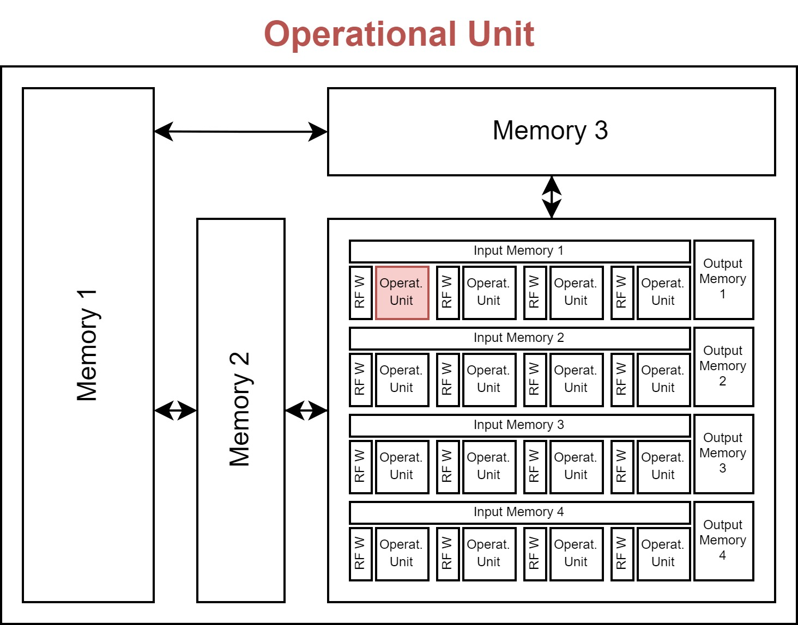
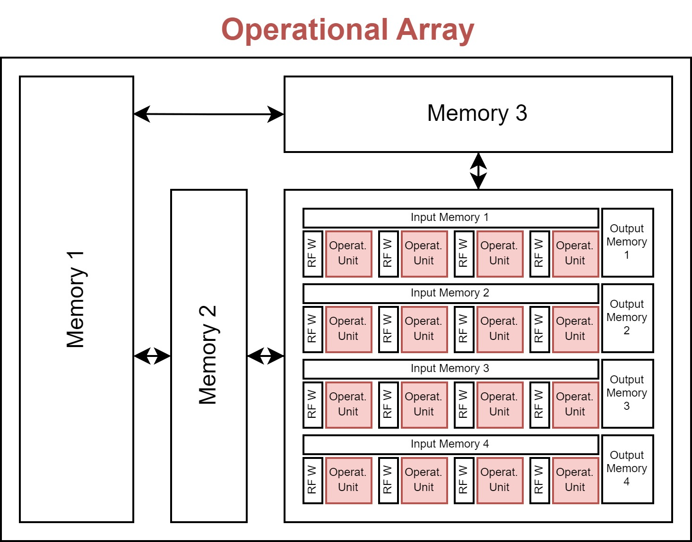
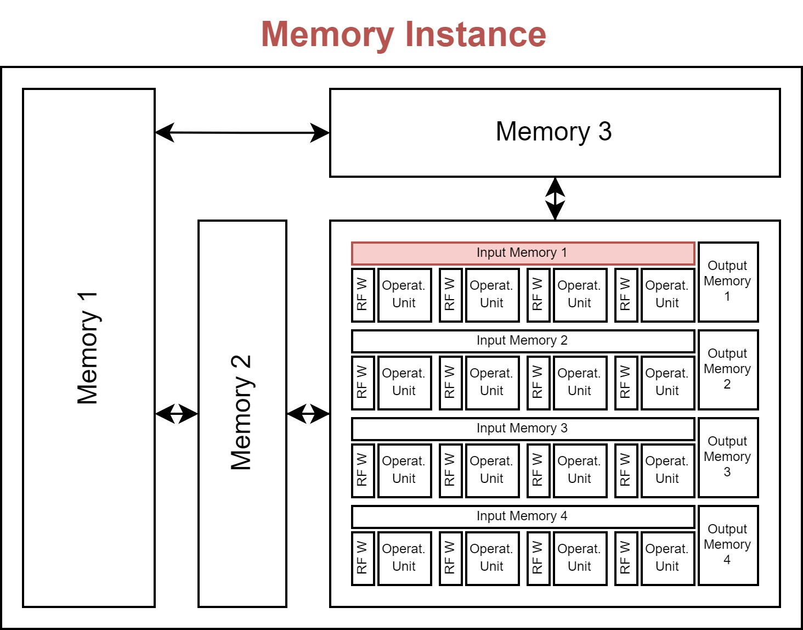
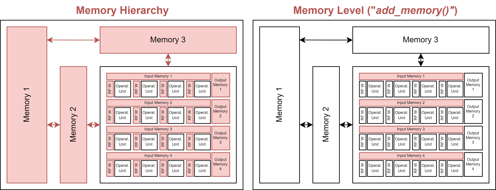

Hardware Architecture
=====================

In this section, we introduce the general concept of how hardware accelerators are modeled within ZigZag and the different well-known accelerators we provide as examples. We start from the smallest building block defined in ZigZag and work our way up towards an accelerator.

Operational Unit
----------------

Accelerating inference of a neural network requires the execution of multiplications and summations (accumulations) across multiple intermediate data (activations) using trained parameters (weights). The operational unit, typically a Multiplier, executes the multiplication of two data elements, typically an activation and a weight. 

The operational unit object has the following attributes:

* **input_precision**: List of input operand (data) precision in the number of bits for each input operand (typically there are two input operands for a Multiplier).
* **output_precision**: The bit precision of the operation's output (e.g., for a multiplier, the output_precision is auto-set to be the sum of two input operands' precision).
* **energy**: Energy of executing a single operation (e.g., a multiplication).
* **area**: The hardware area overhead of a single operational unit (e.g., a multiplier).

Operational Array
-----------------

Inferencing a neural network typically requires millions of operations, and an accelerator typically includes an array of operational units that can execute these operations in parallel. This can significantly speed up the computations, as well as increase energy efficiency which is covered later.

The array can have one or multiple dimensions, each with a size. The importance of these dimensions is explained in the introduction of the memory hierarchy.

The operational array object has the following attributes:

* **operational_unit**: The operational unit from which the array is built.
* **dimensions**: The dimensions of the array. The dimensions must be defined as 'D1', 'D2', ... and the values being the size of the corresponding dimension (i.e. the size of the array along that dimension).

Memory Instance
---------------

In order to store different activations and weights used for the computations in the operational array, different memory instances are attached in a hierarchical fashion. The instances define how big each memory is in terms of capacity and area, what the cost of writing and reading from these memories is, what its bandwidth is, and how many read/write/read-write ports it includes.

The memory instance object has the following attributes:

* **name**: A name for the instance.
* **size**: The memory size in bits.
* **r_bw/w_bw**: A read or write bandwidth in the number of bits per cycle.
* **r_cost/w_cost**: A read or write energy cost (for all bits in a single cycle).
* **area**: Area overhead of the instance.
* **r_port/w_port/rw_port**: The number of read/write/read-write ports the instance has available.
* **latency**: The latency of memory access in the number of cycles, i.e., after requiring read/write a memory address, how many cycles the memory takes to provide/receive this corresponding data. (For now, this attribute is not actively used. We assume that it is 1 to model the data prefetching behavior thanks to the deterministic dataflow.)

(optional)

* **min_r_granularity/min_w_granularity**: The minimal memory read/write granularity (in bit) the memory supports. This attribute is used to better model the memory that supports half-word access or quarter-word access patterns. For example, if a memory's read bandwidth (wordlength) is 256 bit/cycle, its read energy (r_cost) is 100, and its min_r_granularity is 128 bits (i.e., assume this memory allow half-word read), read 128 bits from it (we assume that) will only take 50 units of energy. If min_r_granularity is not defined (or is defined as 256 bits), read 128 bits from it will consume 100 units of energy.

Memory Hierarchy
----------------

Besides knowing what the specs of each memory instance are, the memory hierarchy encodes information with respect to the interconnection of each memory to the operational array, and to other memory instances. The hierarchy is automatically constructed based on the order in which the instances are defined. The lowest-level instances must be defined first.

To know if the memory should connect to the operational array or another lower memory level, it needs to know which data will be stored within the memories. To decouple the algorithmic side from the hardware side, this is achieved through the concept of 'memory operands' (as opposed to 'algorithmic operands which are typically the Input/Output activations and weights W). You can think of the memory operands as virtual operands, which will later be linked to the actual algorithmic operands in the mapping file through the `memory_operand_links` attribute.

Similarly to how the operational unit can be unrolled (forming an operational array), the memories can also be unrolled, where each memory accompanies either a single operational unit or all the operational units in one or more dimensions of the operational array. This is encoded through the `served_dimensions` attribute, which specifies if a single memory instance of this memory level serves all operational units in that dimension. This should be a set of one-hot-encoded tuples.

For example, assuming an operational array has 2 dimensions: ``{D1: 3, D2: 4}``. There are four common `served_dimensions` settings for a memory level:

1. ``[]`` (empty): the memory does not serve any array dimensions, meaning the memory is unrolled with each operational unit, i.e., there are, in total 12 such memory instances.
2. ``[D1]``: the memory serves array dimension D1, meaning the memory is unrolled with D2, and each memory instance serves all 3 operational units along D1, i.e., there are, in total 4 such memory instances.
3. ``[D2]``: the memory serves array dimension D2, meaning the memory is unrolled with D1, and each memory instance serves all 4 operational units along D2, i.e., there are, in total 3 such memory instances.
4. ``[D1, D2]``: the memory serves all array dimensions, both D1 and D2, meaning the memory is not unrolled with each operational unit but serves all of them, i.e., there are, in total 1 such memory instance.

Lastly, the different read/write/read-write ports a memory instance has, are assigned to the different data movements possible in the hierarchy. There are four types of data movements in a memory in the hierarchy: from high (*fh*), to high (*th*), from low (*fl*), to low (*tl*).

- **fh**: from high, meaning the data is provided by the higher level of memory to be **written** to the current level of memory
- **th**: to high, meaning the data is **read** out from the current level of memory to go to the higher level of memory
- **fl**: from low, meaning the data is provided by the lower level of memory to be **written** to the current level of memory
- **tl**: to low, meaning the data is **read** out from the current level of memory to go to the lower level of memory

At the time of writing, these can be manually linked to one of the read/write/read-write ports through the following syntax: ``{port_type}_port_{port_number}``, *port_type* being *r*, *w* or *rw* and *port_number* equal to the port number, starting from 1, which allows allocating multiple ports of the same type. Alternatively, these are automatically generated as a default if not provided in the definition.

Internally, the MemoryHierarchy object extends the `NetworkX DiGraph <https://networkx.org/documentation/stable/reference/classes/digraph.html>`_ object, so its methods are available. 

Core
----

The operational array and the memory hierarchy together form a core of the accelerator. In ZigZag, all accelerators are single core. The concept of the core layer is preserved to be compatible with Stream. 

.. image:: images/hardware-architecture/core.jpg
  :width: 400

hardware Accelerator Model
--------------------

The core is wrapped in the hardware Accelerator, which is the main object modeling the hardware behavior.

Modelled examples
-----------------

In this repository, we have modeled 5 well-known DNN accelerators, which are Meta prototype [1], TPU [2], Edge TPU [3], Ascend [4], Tesla NPU [5], and, for our depth-first scheduling research.
To make a fair and relevant comparison, we normalized all of them to have 1024 MACs and maximally 2MB global buffer (GB) but kept their spatial unrolling and local buffer settings, as shown in Table I Idx 1/3/5/7/9.
Besides, we constructed a variant of every normalized architecture (by changing its on-chip memory hierarchy), denoted with ‘DF’ in the end of the name, as shown in Table I Idx 2/4/6/8/10.

Specific settings
-----------------

.. image:: https://user-images.githubusercontent.com/55059827/183848886-c85b9950-5e49-47c9-8a47-ad05062debc3.png
  :width: 800
  :alt: Alternative text

.. note::

    K is for output channel; C is for input channel; OX and OY are the output feature map's spatial dimensions; FX and FY are the weight's spatial dimensions.

References
----------

[1] H. E. Sumbul, T. F. Wu, Y. Li, S. S. Sarwar, W. Koven, E. Murphy-
Trotzky, X. Cai, E. Ansari, D. H. Morris, H. Liu, D. Kim, E. Beigne,
R. Labs, and Meta, “System-level design and integration of a prototype
ar/vr hardware featuring a custom low-power dnn accelerator chip in
7nm technology for codec avatars,” in 2022 IEEE Custom Integrated
Circuits Conference (CICC), 2022, pp. 01–08.

[2] N. P. Jouppi, C. Young, N. Patil, D. Patterson, G. Agrawal, R. Bajwa,
S. Bates, S. Bhatia, N. Boden, A. Borchers, R. Boyle, P.-l. Cantin,
C. Chao, C. Clark, J. Coriell, M. Daley, M. Dau, J. Dean, B. Gelb, T. V.
Ghaemmaghami, R. Gottipati, W. Gulland, R. Hagmann, C. R. Ho,
D. Hogberg, J. Hu, R. Hundt, D. Hurt, J. Ibarz, A. Jaffey, A. Jaworski,
A. Kaplan, H. Khaitan, D. Killebrew, A. Koch, N. Kumar, S. Lacy,
J. Laudon, J. Law, D. Le, C. Leary, Z. Liu, K. Lucke, A. Lundin,
G. MacKean, A. Maggiore, M. Mahony, K. Miller, R. Nagarajan,
R. Narayanaswami, R. Ni, K. Nix, T. Norrie, M. Omernick,
N. Penukonda, A. Phelps, J. Ross, M. Ross, A. Salek, E. Samadiani,
C. Severn, G. Sizikov, M. Snelham, J. Souter, D. Steinberg, A. Swing,
M. Tan, G. Thorson, B. Tian, H. Toma, E. Tuttle, V. Vasudevan,
R. Walter, W. Wang, E. Wilcox, and D. H. Yoon, “In-datacenter
performance analysis of a tensor processing unit,” SIGARCH Comput.
Archit. News, vol. 45, no. 2, p. 1–12, jun 2017. 

[3] A. Yazdanbakhsh, K. Seshadri, B. Akin, J. Laudon, and
R. Narayanaswami, “An Evaluation of Edge TPU Accelerators for
Convolutional Neural Networks,” arXiv e-prints, p. arXiv:2102.10423,
Feb. 2021.

[4] H. Liao, J. Tu, J. Xia, H. Liu, X. Zhou, H. Yuan, and Y. Hu,
“Ascend: a scalable and unified architecture for ubiquitous deep neural
network computing : Industry track paper,” in 2021 IEEE International
Symposium on High-Performance Computer Architecture (HPCA), 2021,
pp. 789–801.

[5] E. Talpes, D. D. Sarma, G. Venkataramanan, P. Bannon, B. McGee,
B. Floering, A. Jalote, C. Hsiong, S. Arora, A. Gorti, and G. S. Sachdev,
“Compute solution for tesla’s full self-driving computer,” IEEE Micro,
vol. 40, no. 2, pp. 25–35, 2020.

