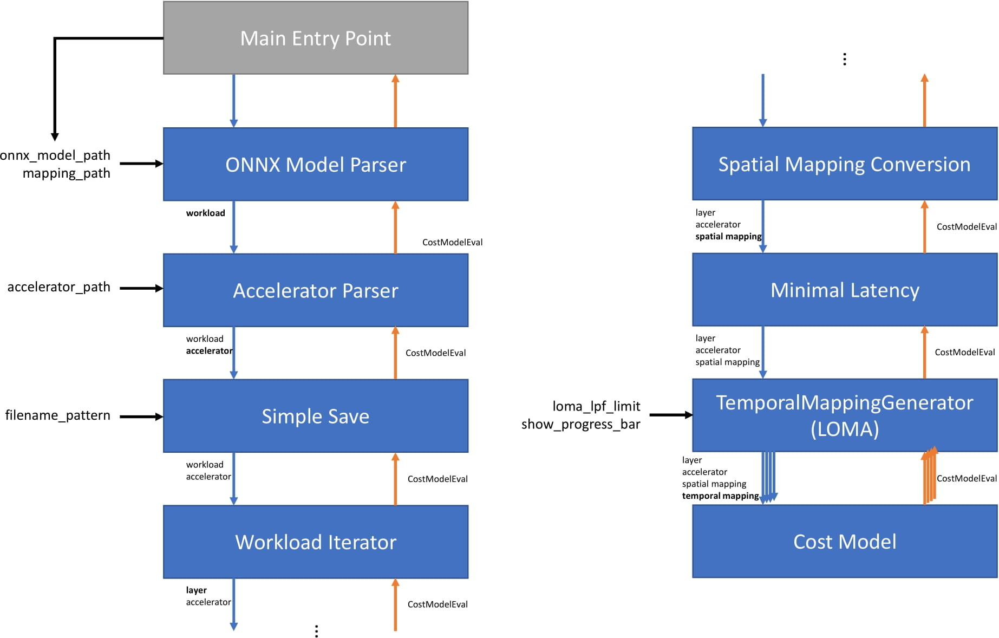

======
Stages
======

This document explains the concept of stages within the ZigZag framework. It details the different implemented stages and explains how to create your own.

Introduction
============

Stages within ZigZag are used to modularly and easily adapt the functionality of the framework. The different stages and their sequence of execution determine the goal of running the framework. The sequence of stages the framework will run through are defined in the main file. An example as follows:

.. code-block:: python

    mainstage = MainStage(
        [  # Initialize the MainStage as entry point
            workload_parser_stage,  # Parse the ONNX Model into the workload
            AcceleratorParserStage,  # Parse the accelerator module/passthrough given accelerator
            SimpleSaveStage,  # Save the summed CME energy and latency to a json
            PickleSaveStage,  # Save all received CMEs in a list to a pickle file
            SumStage,  # Sum up the received best CME across all layers of the workload
            WorkloadStage,  # Iterate through the different layers in the workload
            VisualizationStage,  # Save the chosen loop ordering and memory hierarchy
            CompleteSaveStage,  # Save each processed layer to a json
            opt_stage,  # Reduce all CMEs, returning minimal energy/latency one
            SpatialMappingGeneratorStage,  # Generate multiple spatial mappings (SM)
            opt_stage,  # Reduce all CMEs, returning minimal energy/latency one
            LomaStage,  # Generate multiple temporal mappings (TM)

            CostModelStage,  # Evaluate generated SM and TM through cost model
        ],
        accelerator=args.accelerator,  # required by AcceleratorParserStage
        workload=args.workload,  # required by workload_parser_stage
        mapping=args.mapping,  # required by workload_parser_stage
        dump_folder=args.dump_folder,  # output file save pattern
        pickle_filename=args.pickle_filename,  # filename for pickled list of cmes
        loma_lpf_limit=args.lpf_limit,  # required by LomaStage
        loma_show_progress_bar=True,
        # Max nb of spatial mappings that are automatically generated in SpatialMappingGeneratorStage
        nb_mappings_generated=nb_spatial_mappings_generated,
        # Whether `mixed` mappings (e.g. `D1: {K:8, C:4}`) can be generated
        enable_mix_spatial_mapping_generation=False,
        # If we need access the same input data multiple times from the innermost memory level and the data size is
        # smaller than the memory read bw,
        # take into account only one-time access cost (assume the data can stay at the output pins of the memory as
        # long as it is needed).
        # By default, if the parameter is not defined, it will be set as False internally.
        access_same_data_considered_as_no_access=True,
    )

    # Launch the MainStage
    cmes = mainstage.run()

This corresponds to the following hierarchy:

The main entry point
--------------------

You can think of stages similar to those in a pipelined system. The ``MainStage`` provides an entry point for the framework to start execution from. All stages save the provided first argument as the sequence of remaining stages, of which the first one will be called when running said stage. In our example, the ``MainStage`` will automatically call the ``ONNXModelParserStage`` with the remaining stages ``[AcceleratorParserStage, SimpleSaveStage, ...]`` as its first argument. Besides the sequence of stages, the remaining arguments (e.g. ``accelerator``, ``onnx_model_path``, ...) of the ``MainStage`` initialization are arguments required by one or more of the later stages.
You can think of stages similar to those in a pipelined system. The ``MainStage`` provides an entry point for the framework to start execution from. All stages save the provided first argument as the sequence of remaining stages, of which the first one will be called when running said stage. In our example, the ``MainStage`` will automatically call the ``ONNXModelParserStage`` with the remaining stages ``[AcceleratorParserStage, SimpleSaveStage, ...]`` as its first argument. Besides the sequence of stages, the remaining arguments (e.g. ``accelerator``, ``onnx_model_path``, ...) of the ``MainStage`` initialization are arguments required by one or more of the later stages.

The sequential call of stages
-----------------------------

After the ``MainStage`` initialization, the remaining stages are called in an sequential order. The ``ONNXModelParserStage`` will call the ``AcceleratorParserStage``, and so on. 

The ``ONNXModelParserStage`` parses the ONNX model into the workload and the ``AcceleratorParserStage`` parses the accelerator based on the hardware architecture description. After this, the ``SimpleSaveStage`` is called, which will save the results of the design space exploration in a file in a later step. Further description about this step can be found in `back-passing-label`_.

The ``WorkloadStage`` iterates through each layer in the parsed workload, and for each layer it finds spatial mappings (SM) in the ``SpatialMappingGeneratorStage``. The temporal mapping generator stage below (``TemporalMappingGeneratorStage``) generates multiple temporal mappings (TM), and each SM + TM combination is fed to the cost model for HW cost evaluation. 

The back passing of results
---------------------------

.. _back-passing-label:

So far, we have only discussed the sequential calling of stages from first to last. The reverse also holds true: when the ``CostModelStage`` finishes processing a SM + TM conbimation, it yields a CostModelEvaluation (CME) object back up the chain of stages. Some stages will simply pass this CME further up the chain, while others manipulate what is passed back up the chain. The ``MinimalLatencyStage`` for example, receives all the CMEs from the multiple cost model invocations for different TMs, but only passes the CME with the lowest latency back up the chain across all TMs. As such, the ``SimpleSaveStage`` only receives the CME with the lowest latency, which it will save to a file in the ``dump_folder`` folder.

Implemented stages
==================

This section is still being updated. For a missing description, please look at the stages requirements in `__init__.py <https://github.com/KULeuven-MICAS/zigzag/blob/master/zigzag/classes/stages/__init__.py>`_ and the stage implementation in the `stages <https://github.com/KULeuven-MICAS/zigzag/tree/master/zigzag/classes/stages>`_ folder.

.. _custom-stages-label:

Input parser stages
-------------------
* `AcceleratorParserStage <https://github.com/KULeuven-MICAS/zigzag/tree/master/zigzag/classes/stages/MainInputParserStages.py#L12>`_: Parse the accelerator description from the inputs.
* `WorkloadParserStage <https://github.com/KULeuven-MICAS/zigzag/tree/master/zigzag/classes/stages/MainInputParserStages.py#L47>`_: Parse the input workload residing in workload_path. Used when workload is defined manually by the user.
* `ONNXModelParserStage <https://github.com/KULeuven-MICAS/zigzag/tree/master/zigzag/classes/stages/ONNXModelParserStage.py#L11>`_: Parse the input workload residing in onnx_model_path. Used when workload is defined through a ONNX model.

Iterator stage
--------------
* `GeneralParameterIteratorStage <https://github.com/KULeuven-MICAS/zigzag/tree/master/zigzag/classes/stages/GeneralParameterIteratorStage.py#L10>`_: General iterator over any parameter whose values can be set from a predetermined list
* `WorkloadStage <https://github.com/KULeuven-MICAS/zigzag/tree/master/zigzag/classes/stages/WorkloadStage.py#L11>`_: Class that iterates through the nodes in a given workload graph.

Plot stages
-----------
* `PlotTemporalMappingsStage <https://github.com/KULeuven-MICAS/zigzag/tree/master/zigzag/classes/stages/PlotTemporalMappingsStage.py#L11>`_: Class that passes through all results yielded by substages, but keeps the TMs cme's and saves a plot.

Reduce stages
-------------
* `MinimalEnergyStage <https://github.com/KULeuven-MICAS/zigzag/tree/master/zigzag/classes/stages/ReduceStages.py#L10>`_: Class that keeps yields only the cost model evaluation that has minimal energy of all cost model evaluations generated by it's substages created by list_of_callables
* `MinimalLatencyStage <https://github.com/KULeuven-MICAS/zigzag/tree/master/zigzag/classes/stages/ReduceStages.py#L52>`_: Class that keeps yields only the cost model evaluation that has minimal latency of all cost model evaluations generated by it's substages created by list_of_callables
* `MinimalEDPStage <https://github.com/KULeuven-MICAS/zigzag/tree/master/zigzag/classes/stages/ReduceStages.py#L91>`_: Class that keeps yields only the cost model evaluation that has minimal EDP of all cost model evaluations generated by it's substages created by list_of_callables
* `SumStage <https://github.com/KULeuven-MICAS/zigzag/tree/master/zigzag/classes/stages/ReduceStages.py#L127>`_: Class that keeps yields only the sum of all cost model evaluations generated by its substages created by list_of_callables
* `ListifyStage <https://github.com/KULeuven-MICAS/zigzag/tree/master/zigzag/classes/stages/ReduceStages.py#L156>`_: Class yields all the cost model evaluations yielded by its substages as a single list instead of as a generator.

Optimization stages
-------------------
* `RemoveExtraInfoStage <https://github.com/KULeuven-MICAS/zigzag/tree/master/zigzag/classes/stages/RunOptStages.py#L11>`_: Strips extra info for subcallables to save memory
* `CacheBeforeYieldStage <https://github.com/KULeuven-MICAS/zigzag/tree/master/zigzag/classes/stages/RunOptStages.py#L33>`_: Caches results in a list and then yields them. This breaks the yield flow from top to bottom.
* `SkipIfDumpExistsStage <https://github.com/KULeuven-MICAS/zigzag/tree/master/zigzag/classes/stages/RunOptStages.py#L59>`_: Check if the output file is already generated, skip the run if so.
* `MultiProcessingSpawnStage <https://github.com/KULeuven-MICAS/zigzag/tree/master/zigzag/classes/stages/RunOptStages.py#L114>`_: Multiprocessing support stage.
* `MultiProcessingGatherStage <https://github.com/KULeuven-MICAS/zigzag/tree/master/zigzag/classes/stages/RunOptStages.py#L159>`_: Multiprocessing support stage.

Save and dump stages
--------------------
* `CompleteSaveStage <https://github.com/KULeuven-MICAS/zigzag/tree/master/zigzag/classes/stages/SaveStage.py#L14>`_: Class that passes through all results yielded by substages, but saves the results as a json list to a file at the end of the iteration.
* `SimpleSaveStage <https://github.com/KULeuven-MICAS/zigzag/tree/master/zigzag/classes/stages/SaveStage.py#L74>`_: Class that passes through results yielded by substages, but saves the results as a json list to a file at the end of the iteration. In this simple version, only the energy total and latency total are saved.
* `PickleSaveStage <https://github.com/KULeuven-MICAS/zigzag/tree/master/zigzag/classes/stages/SaveStage.py#L133>`_: Class that dumps all received CMEs into a list and saves that list to a pickle file.
* `DumpStage <https://github.com/KULeuven-MICAS/zigzag/tree/master/zigzag/classes/stages/DumpStage.py#L8>`_: Class that passes through all results yielded by substages, but dumps the results as a pickled list to a file at the end of the iteration

Temporal mapping stages
-----------------------
* `TemporalMappingGeneratorStage <https://github.com/KULeuven-MICAS/zigzag/tree/master/zigzag/classes/stages/TemporalMappingGeneratorStage.py#L10>`_: Class that iterates through the different temporal mappings generated through the loop order based memory allocation (loma) engine
* `SalsaStage <https://github.com/KULeuven-MICAS/zigzag/tree/master/zigzag/classes/stages/SalsaStage.py#L47>`_: Class that return the best temporal mapping found by the Simulated Annealing Loop-ordering Scheduler for Accelerators (SALSA) for a single layer.
* `TemporalOrderingConversionStage <https://github.com/KULeuven-MICAS/zigzag/tree/master/zigzag/classes/stages/TemporalOrderingConversionStage.py#L10>`_: Run this stage by converting the user-defined temporal loop ordering to the memory-level based temporal mapping representation.

Spatial mapping stages
----------------------
* `SpatialMappingConversionStage <https://github.com/KULeuven-MICAS/zigzag/tree/master/zigzag/classes/stages/SpatialMappingConversionStage.py#L11>`_: Pipeline stage that converts the spatial mapping from user-provided spatial mapping across operational array dimensions to the internal spatial mapping representation used in the cost model.
* `SpatialMappingGeneratorStage <https://github.com/KULeuven-MICAS/zigzag/tree/master/zigzag/classes/stages/SpatialMappingGeneratorStage.py#L12>`_:     Pipeline stage that finds spatial mappings given a accelerator, core allocation, interconnection pattern on the allocated core and a layer. The spatial mappings are found using the interconnection pattern present on the core. The inner-most memory level served dimensions is used, as this is how the memories connect to the operational array.

Cost model stages
-----------------
* `CostModelStage <https://github.com/KULeuven-MICAS/zigzag/tree/master/zigzag/classes/stages/CostModelStage.py#L15>`_: Pipeline stage that calls a cost model to evaluate a (temporal and spatial) mapping on a hardware config.

Hardware modification stages
-----------------
* `SearchInterLayerDataLocalityStage <https://github.com/KULeuven-MICAS/zigzag/blob/master/zigzag/classes/stages/SearchInterLayerDataLocalityStage.py#L74>`_: Class that iterates through the memory instances and return the lowest allowed memory level for each operand for the usage of the next layer. The class must be placed before the WorkloadStage. The parameter `workload_data_always_from_top_mem <https://github.com/KULeuven-MICAS/zigzag/blob/master/zigzag/classes/stages/SearchInterLayerDataLocalityStage.py#L164>`_ is False by default, which means the initial input and final output of the entire workload can be from a memory level lower than the highest memory level. You can set it to True if the initial input data and final output of the entire workload must travel from/to the highest memory level.
* `ExploitInterLayerDataLocalityStage <https://github.com/KULeuven-MICAS/zigzag/blob/master/zigzag/classes/stages/ExploitInterLayerDataLocalityStage.py#L34>`_: Class that remove the unused memory instances according to the result of SearchInterLayerDataLocalityStage. Each memory instance with a level higher than the level returned from SearchInterLayerDataLocalityStage will be considered as an unused memory and will be removed. This stage must be placed after the WorkloadStage.

Creating your custom stage
==========================

Let's say you are not interested in saving the CME with minimal energy, but want to save based on another metric provided by the CME, or you want to define a new temporal mapping generator stage, you can easily create a custom stage. The easiest way is copying an existing stage class definition, and modifying it according to your intended behaviour. To guarantee correctness, following aspects have to be taken into account when creating a custom stage:

* It must inherit from the abstract ``Stage`` class.
* It must create its ``substage`` as the first element of the list of callables, with the remaining list as its first argument, and ``**kwargs`` as the second argument. These kwargs can be updated to change e.g. the accelerator, spatial mapping, temporal mapping, etc.
* It must iterate over the different ``(CME, extra_info)`` tuples yielded by the ``substage.run()`` call in a for loop.
* If the stage is a reduction (like e.g. the ``MinimalLatencyStage``), its ``yield`` statement must be outside the for loop which iterates over the returned ``(CME, extra_info)`` tuples, where some processing happens inside the for loop.

