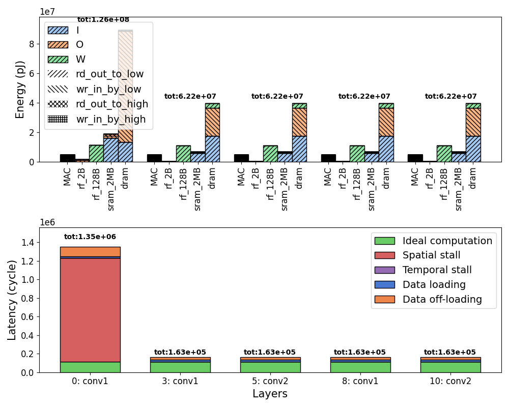

=============
Visualization
=============

The generated ``CostModelEvaluation`` object(s) (from e.g. the API call) can be visualized in multiple ways. The visualizations described here are automatically generated when running the ``example.py`` script.

Temporal mapping
================

The temporal mapping can be visualized by a function that prints it to the terminal.
The code block demonstrates how to use it (copied from ``example.py``):

.. code:: python

    from zigzag.utils import pickle_load
    from zigzag.visualization.results.print_mapping import print_mapping

    pickle_filename = f"outputs/list_of_cmes.pickle"
    with open(pickle_filename, "rb") as fp:
        cmes = pickle.load(fp)

    print_mapping(cmes[0])

The function will show the loops of the temporal mapping and for each operand shows at which memory level it resides.
For example:

::

    Loop ordering for /conv1/Conv
    ==================================================================================
    Temporal Loops                       I              W              O              
    ==================================================================================
    for OX in [0, 16):                   dram           dram           dram           
    ----------------------------------------------------------------------------------
    for OX in [0, 7):                  sram_256KB     dram           dram           
    ----------------------------------------------------------------------------------
        for FY in [0, 7):                sram_256KB     dram           sram_256KB     
    ----------------------------------------------------------------------------------
        for C in [0, 3):               sram_256KB     dram           sram_256KB     
    ----------------------------------------------------------------------------------
            for OY in [0, 16):           sram_256KB     cells          sram_256KB     
    ----------------------------------------------------------------------------------
            for OY in [0, 7):          sram_256KB     cells          sram_256KB     
    ----------------------------------------------------------------------------------
    ==================================================================================
    Spatial Loops                                                                     
    ==================================================================================
                parfor K in [0, 64):                                                  
    ----------------------------------------------------------------------------------
                parfor FX in [0, 7):                                                  
    ----------------------------------------------------------------------------------

The top loop is the outer-most for loop, where as the bottom loop is the inner-most. Going from bottom to top, loops are allocated to the innermost memories of the memory hierarchy for each operand.

Energy and latency breakdown
============================

The energy and latency breakdown of a list of ``CostModelEvaluation`` objects can be plotted using the ``bar_plot_cost_model_evaluations_breakdown`` function:

.. code:: python

    from zigzag.utils import pickle_load
    from zigzag.visualization.results.plot_cme import bar_plot_cost_model_evaluations_breakdown

    pickle_filename = f"outputs/list_of_cmes.pickle"
    with open(pickle_filename, "rb") as fp:
        cmes = pickle.load(fp)

    bar_plot_cost_model_evaluations_breakdown(cmes, save_path="outputs/plot_breakdown.png")

This will produce a bar chart, for example:

