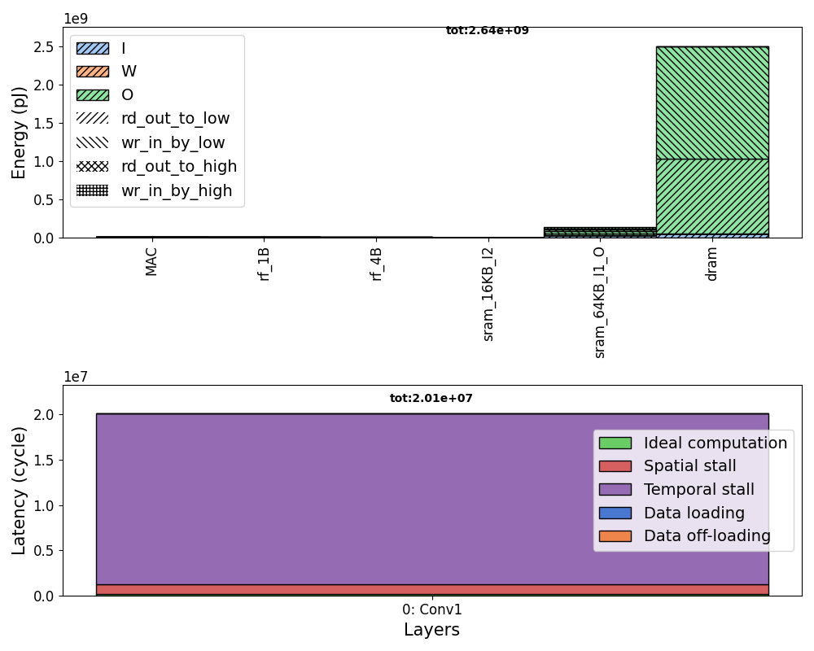
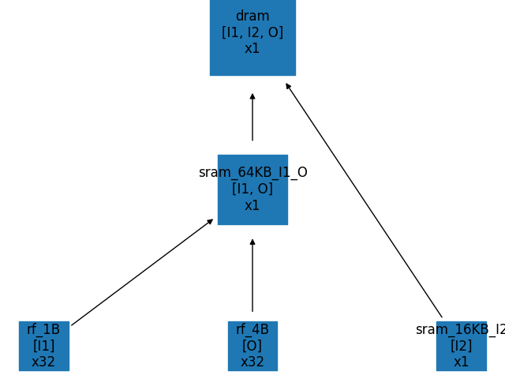

# Lab 1: First Run of the ZigZag Framework

## Objective
The goal of this lab is to perform the first run of the ZigZag framework. You will execute the first layer of ResNet-18 on a defined accelerator configuration with a constrained mapping.

## Setup
1. Ensure you have installed the requirements in `requirements.txt`.
2. Make sure you are in the base directory, as `lab1/main.py` automatically inserts this into PATH which is needed for the ZigZag imports.

## Inputs
There are three main inputs defined in the `inputs/` folder:
1. **Workload**: The first layer of ResNet18 in ONNX format. The layer name is `Conv1`. You can use [Netron](https://netron.app) to visualize the model.
2. **Hardware**: A sample accelerator is encoded in `accelerator1.yaml`. This accelerator includes 32x32 operational units with a hierarchy of memories attached which store different `memory operands I1, I2, O`.
3. **Mapping**: The mapping specifies for the `Conv1` layer both the spatial mapping and the temporal loop ordering. The spatial mapping links to the dimensions of the operational array defined in the hardware. The temporal loop ordering specifies the orders of the loops from inner to outer. Additionally, the mapping also specifies the operand links which link together the `memory operands` and the `layer operands`.

## Running the Experiment

The main file located at `lab1/main.py` sets the paths to the three main inputs, parses out some more names and an `experiment_id` to use for the saving of the outputs and calls the ZigZag API as follows:
```python
energy, latency, results = get_hardware_performance_zigzag(
    accelerator=accelerator,
    workload=workload,
    mapping=mapping,
    temporal_mapping_search_engine=temporal_mapping_search_engine,
    opt=optimization_criterion,
    dump_folder=dump_folder,
    pickle_filename=pickle_filename,
)
```
Besides the three main inputs, there are several other parameters required for this API call. `temporal_mapping_search_engine` chooses the engine to use under the hood to optimize the temporal mapping. This is typically set to `loma` but can also be `salsa`. The `opt` parameter specifies what to optimize spatial/temporal mappings for. This can be `latency`, `energy` or `EDP`. The last two parameters `dump_folder` and `pickle_filename` are required for output saving.

Now that you understand the paremeters of the API call, launch it through the main file:
```python
# Call this from the base folder
python lab1/main.py
```

    
The mapping is fixed in both the spatial and temporal domains, resulting in a single cost model evaluation (CME).

## Outputs
The results of the experiment will be saved in the `outputs/` folder.

- `breakdown.png` shows an energy and latency breakdown for the different layers evaluated (only one here). The energy is broken down into the operational level (MAC) and memory levels. As each memory level can store one or more operands, it is colored by operand. Moreover, it breaks down the energy cost for 4 different read/write directions of the memory. The latency is broken down into the ideal computation time (assuming perfect utilization of the operational array), the added cycles due to spatial stalls which represent the spatial underutilization (due to imperfect spatial loop unrolling), the added cycles due to temporal stalls (due to imperfect memory bandwidth), and the added on-loading and off-loading cycles (due to the very first.last iteration on/off-loading of inputs/outputs).


- `Conv1_complete.json` contains all input and output information of the cost model evaluation. 

- `overall_simple.json` aggregates the energy and latency of all layers (only one here).

- `mem_hierarchy.png` shows the constructed hierarchy of memories and for each level which operands they store and the amount of times it's replicated (more info on this in `lab3`).
 

- `loop_ordering.txt` shows for all evaluated layers the returned mapping. This includes both the temporal aspect, where different loops are assigned at the memory levels (which can be different for different operands due to ZigZag's uneven mapping representation). The spatial aspect shows the spatially unrolled loops.
```
Loop ordering for Conv1
============================================================================================
Temporal Loops                     O                  W                  I                  
============================================================================================
for K in [0, 2):                   dram               sram_16KB_I2       dram               
--------------------------------------------------------------------------------------------
  for FY in [0, 7):                dram               sram_16KB_I2       dram               
--------------------------------------------------------------------------------------------
    for FX in [0, 7):              dram               sram_16KB_I2       dram               
--------------------------------------------------------------------------------------------
      for OY in [0, 112):          dram               sram_16KB_I2       sram_64KB_I1_O     
--------------------------------------------------------------------------------------------
        for OX in [0, 112):        sram_64KB_I1_O     sram_16KB_I2       sram_64KB_I1_O     
--------------------------------------------------------------------------------------------
============================================================================================
Spatial Loops                                                                               
============================================================================================
          parfor K in [0, 32):                                                              
--------------------------------------------------------------------------------------------
          parfor C in [0, 3):                                                               
--------------------------------------------------------------------------------------------

```

## Questions & Answers

- Take a look inside the ZigZag API call in `zigzag/api.py`. Do you understand the meaning of all the defined stages and all arguments passed to these stages?
    > <details>
    > <summary>Answer</summary>
    >     
    > You can read more information on the different stages [here](https://kuleuven-micas.github.io/zigzag/stages.html). Each stage performs a different function, ranging from parsing inputs to generating temporal mappings to evaluating the cost model. Others filter multiple mappings to only keep the best one(s), or make sure results can be aggragated across multiple layers in a robust way.
    >   
    > </details>

- How does the fixed temporal ordering in `lab1/inputs/mapping/mapping.yaml` match with the produced temporal mapping? What information did you not give as an input but was inferred by the framework?
    > <details>
    > <summary>Answer</summary>
    > 
    > The LOMA engine inside of the `TemporalMappingGeneratorStage` takes in the defined `temporal_ordering` and allocates the different temporal loops from inner to outer to the memories in the hierarchy. This is the extra information you see in the printed mapping: for every operand and every loop, it shows the memory level it was allocated to.
    > 
    > </details>

- Analyze the fields of `lab1/outputs/tpu_like-resnet18_first_layer/Conv1_complete.json`. How much energy went to memory read/writes versus operations?
    > <details>
    > <summary>Answer</summary>
    >     
    > The json contains the following fields:   
    >     "operational_energy": 4720558.08
    >     "memory_energy": 2637751874.296
    > 
    > As such, the memory reads/writes account for 99.8% of the total energy. Of course this value heavily depends on the defined `unit_energy` for operations and the defined read and write energy cost of the memories.
    >   
    > </details>
