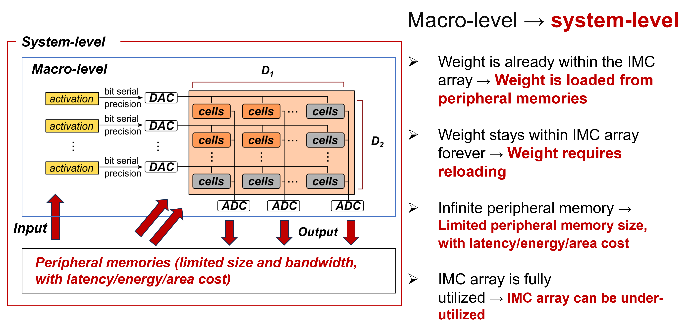

# Lab 5: System-Level Evaluation for IMC: Spatial Utilization Matters

## Objective
In the previous lab, you have understood the key factors impacting the macro-level IMC performance.
In this lab, you will move to the system level and evaluate the system-level IMC performance.
The goal is to understand how the spatial utilization impacts on the system performance, which is overlooked in the previous lab.

## Background

**The definitions of macro-level and system-level:**

As demonstrated in the image below, we refer the "macro-level" as the pure computation array (you can call it as "PE array", "datapath"), without considering the peripheral memories.
Differently, the "system-level" refers to the entire hardware, considering impacts of both the computation array and the memories in the system.

**Different assumptions of macro/system-level performance evaluation:**
- When evaluating the macro-level performance, we have some ideal assumptions. All of them are listed on the right in the image (text in black).
- When evaluating the system-level performance, all non-idealities are considered (text in red).



## Setup
1. Ensure you have installed the requirements in `requirements.txt`.
2. Make sure you are in the base directory, as `lab5/main.py` automatically inserts this into PATH which is needed for the ZigZag imports.

## Inputs
There are three main inputs defined in the `inputs/` folder:
1. **Workload**: _[Same as lab2]_ The first layer of ResNet18 in ONNX format. The layer name is `Conv1`. You can use [Netron](https://netron.app) to visualize the model.
2. **Hardware**: _[Same as lab2]_ A sample accelerator is encoded in `accelerator.yaml`. This accelerator includes 32x32 operational units with a hierarchy of memories attached which store different `memory operands` `I1`, `I2`, `O`.
3. **Mapping**: The mapping specifies for the `Conv1` layer only the spatial mapping restriction. The `SpatialMappingGeneratorStage` automatically generate all legal spatial mappings. The `TemporalMappingGeneratorStage` automatically detects if there is any user-defined temporal loop ordering and generates multiple temporal mappings to be evaluated by the cost model.

## Running the Experiment

Run the main file:
```python
# Call this from the base folder
python lab5/main.py
```

## Outputs
Some experiment results will be printed out in the terminal (for this lab), and more detailed results will be saved in the `outputs/` folder.

The terminal will show the following parts:

- **peak performance section:** This section presents the peak performance metrics (TOP/s, TOP/s/W, and TOP/s/mm²) of the IMC array under ideal conditions: 100% array utilization, continuous switching activity on all IMC units, and zero sparsity.
- **spatial mapping:** This section presents the spatial mapping loops on the computation loops.
- **energy section:** This section presents the system-level energy and its breakdown.
- **cycle section:** This section presents the system-level cycle count and its breakdown.
- **Tclk section:** This section presents the minimum clock period (ns) and its delay breakdown.
- **area section:** This section presents the total area (mm²) and its breakdown.
- **performance comparison section:** This section presents both the macro-level and the system-level performance.

In the `outputs/` folder, following outputs are saved _[same as lab1/2/3]_:


- `breakdown.png` shows an energy and latency breakdown for the different layers evaluated (only one here). The energy is broken down into the operational level (MAC) and memory levels. As each memory level can store one or more operands, it is colored by operand. Moreover, it breaks down the energy cost for 4 different read/write directions of the memory. The latency is broken down into the ideal computation time (assuming perfect utilization of the operational array), the added cycles due to spatial stalls which represent the spatial underutilization (due to imperfect spatial loop unrolling), the added cycles due to temporal stalls (due to imperfect memory bandwidth), and the added on-loading and off-loading cycles (due to the very first.last iteration on/off-loading of inputs/outputs).

- `Conv1_complete.json` contains all input and output information of the cost model evaluation. 

- `overall_simple.json` aggregates the energy and latency of all layers (only one here).

- `mem_hierarchy.png` shows the constructed hierarchy of memories and for each level which operands they store and the amount of times it's replicated (more info on this in `lab3`).

- `loop_ordering.txt` shows for all evaluated layers the returned mapping. This includes both the temporal aspect, where different loops are assigned at the memory levels (which can be different for different operands due to ZigZag's uneven mapping representation). The spatial aspect shows the spatially unrolled loops.


## Questions & Answers

- What sizes of input register, output register, SRAM and DRAM are used?
    > <details>
    > <summary>Answer</summary>
    >
    > By checking the `inputs/hardware/accelerator.yaml`, it can be seen that:
    > - Input register: 8b (1B)
    > - Output register: 16b (2B)
    > - SRAM: 2097152b (256KB)
    > - DRAM: 8589934592b (1GB)
    >
    > </details>

- What spatial mapping restriction is placed on dimension D1 and D2?
    > <details>
    > <summary>Answer</summary>
    >
    > You can get this information by checking `inputs/mapping/mapping.yaml`. Using the keyword **spatial_mapping_hint**, ZigZag is explicitly directed to allow spatial mapping only for:
    > - The K dimension on D1
    > - The C dimension on D2
    >
    > </details>

- What spatial mapping is chosen by ZigZag? What is the computation array utilization?
    > <details>
    > <summary>Answer</summary>
    >
    > From the terminal output (or from the output file `Vonv1_complete.json`), the chosen spatial mapping by ZigZag is:
    > - D1: (K, 32)
    > - D2: (C, 3)
    > 
    > Deriving from `inputs/hardware/accelerator.yaml`, the computation array in total has 32×32 PEs. Based on the spatial mapping above, the utilized PE count = 32×3.
    >
    > Therefore, the spatial utilization is: (32×3)/(32×32)=9.375%. This means the PE array is severely under-utilized.
    >
    > </details>
  
- Is the system-level performance the same as the macro-level performance? Why?
    > <details>
    > <summary>Answer</summary>
    >
    > From the terminal outputs, the system-level performance are all lower than the macro-level performance:
    > - TOP/s: considering the spatial utilization is 9.375%, the system-level TOP/s is 9.375% of the macro-level TOP/s.
    > - TOP/s/W: the system-level energy efficiency is lower due to two reasons:
    > - - **PE under-utilization:** almost the same macro-level energy (dominated by ADCs) is spent for AIMC even when the PE array is under-utilized.
    > - - **Peripheral memories:** energy is also spent on peripheral memories to read inputs and write back outputs.
    > - TOP/s/mm²: the system-level computation density is lower due to two reasons:
    > - - **Lower throughput:** the TOP/s is lower due to the spatial under-utilization of the PE array.
    > - - **Peripheral memories:** area is also spent on peripheral memories.
    >
    > </details>
  
- What values of D1 and D2 can be set to achieve a higher spatial utilization and higher throughput (TOP/s)?
    > <details>
    > <summary>Answer</summary>
    >
    > To increase the spatial utilization and the throughput, it's important to firstly understand why the spatial utilization is not 100% in current hardware. Analyzing the layer shape (which can be found in `/outputs/accelerator1-resnet18_first_layer/Conv1_complete.json`), the K and C loops are in size of 64 and 3, respectively. This helps understand why (K, 32) and (C, 3) are unrolled on D1 and D2 dimensions.
    > - D1: the spatial unrolling is limited by the hardware capability, as the hardware only support an unrolling up to 32.
    > - D2: the spatial unrolling is limited by the layer shape, as there is only a size of 3 can be unrolled on C loop.
    >
    > With such understanding, we can improve the throughput by adapting configurations for both D1 and D2:
    > - D1: increasing D1 to 64 definitely will double the throughput, as now (K, 64) can be unrolled.
    > - D2: reducing D2 to 3 can increase utilization but doesn't improve throughput. So what other options do we have for throughput improvement? Since D2 is underutilized due to insufficient loop size for unrolling, we should consider using a larger loop. Given the constraints of weight stationary dataflow, our options are limited to C, FX, and FY dimensions. In this lab, we can modify the mapping on D2 to use FX instead, which has a larger loop size of 7 compared to C.
    >
    > </details>